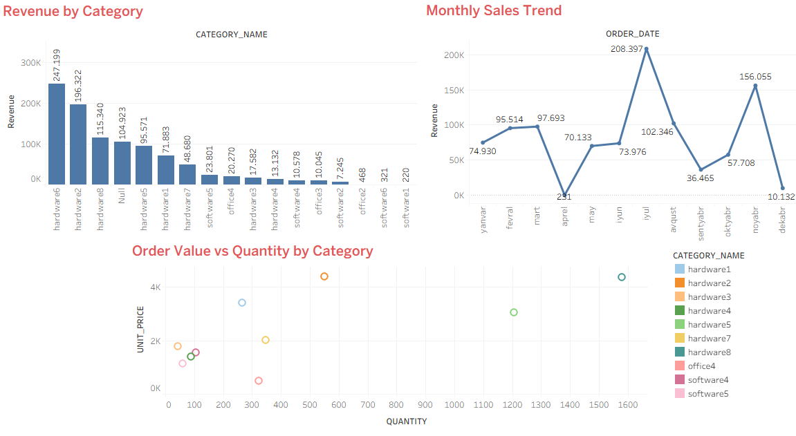

# Order Sales Analysis

SQL və Tableau istifadə edərək məhsul kateqoriyaları üzrə satış performansının və zaman üzrə satış trendinin analizi.

## Məqsəd

Bu layihə aşağıdakı sualları cavablandırır:

- Hansı məhsul kateqoriyası ən çox gəlir gətirir?
- Satış zamanla (ay üzrə) necə dəyişir?
- Kateqoriyalar gəliri necə əldə edir – çox sayda ucuz sifarişlə, yoxsa az sayda bahalı sifarişlə?

## Verilənlər bazası

Oracle-ın standart **OE (Order Entry)** nümunə sxemi istifadə olunub:

- `ORDERS` – 105 sifariş (tarix, status, ödəniş məlumatı)
- `ORDER_ITEMS` – 256 sifariş sətri (məhsul, qiymət, miqdar)
- `PRODUCT_INFORMATION` – 256 məhsul
- `CATEGORIES_TAB` – 22 məhsul kateqoriyası (hardware1-8, office1-4, software1-5 və s.)

## İstifadə olunan alətlər

- **Oracle SQL** – analitik sorğular (JOIN, GROUP BY, TO_CHAR ilə tarix qruplaşdırma)
- **Tableau** – dashboard və vizuallaşdırma

## Metodologiya

1. `ORDER_ITEMS` cədvəlindəki `UNIT_PRICE × QUANTITY` ilə hər sifariş sətrinin gəliri hesablanıb
2. Bu gəlir `PRODUCT_INFORMATION` və `CATEGORIES_TAB` ilə birləşdirilərək kateqoriya üzrə cəmlənib
3. `ORDERS` cədvəlindəki `ORDER_DATE` ay səviyyəsinə endirilərək aylıq satış trendi çıxarılıb
4. Nəticələr Tableau-da 3 qrafikli dashboard-da vizuallaşdırılıb

SQL sorğularının hamısı [`oe_sales_analysis.sql`](./oe_sales_analysis.sql) faylındadır.

## Dashboard

Dashboard-u interaktiv görmək üçün [`dashboard.twbx`](./dashboard_tableau1.twbx) faylını endirib Tableau Desktop-da açın (Tableau Public pulsuz mövcuddur).

Dashboard 3 hissədən ibarətdir:
- **Revenue by Category** – kateqoriya üzrə ümumi gəlir müqayisəsi
- **Overall Monthly Sales Trend** – ümumi satışın zamanla dəyişimi
- **Order Value vs Quantity by Category** – kateqoriyaların gəliri necə əldə etdiyi (qiymət vs miqdar əlaqəsi)

## Əsas nəticələr

**1. "office1" kateqoriyası ən yüksək gəliri gətirir, lakin cəmi 9 sifarişlə.** Bu, kateqoriyanın az sayda, çox yüksək dəyərli sifarişlərlə (ortalama ~105,000/sifariş) satıldığını göstərir.

**2. "hardware" qrupu (hardware1-8) daha fərqli strategiya göstərir** – daha çox sayda sifariş (məsələn hardware8: 70 sifariş), lakin orta/aşağı sifariş dəyəri ilə ümumi gəlirin böyük hissəsini təmin edir.

**3. Satışda aylar üzrə əhəmiyyətli dalğalanma var** – bəzi aylarda (məsələn 2007-06 və 2007-11) satış kəskin artıb, bu, mövsümi kampaniya və ya böyük sifarişlərin təsiri ola bilər.

**4. Order Value vs Quantity qrafiki göstərir ki, kateqoriyalar iki fərqli qrupa bölünür** – "az və bahalı" satan kateqoriyalar (yuxarı-sol küncdə) və "çox və orta qiymətli" satan kateqoriyalar (aşağı-sağ tərəfdə).

## Ümumi nəticə

Gəlir bütün kateqoriyalarda eyni yolla əldə edilmir – bəzi kateqoriyalar az sayda yüksək dəyərli sifarişə, digərləri isə çox sayda orta dəyərli sifarişə əsaslanır. Bu fərq, gələcək satış strategiyası və demand planlaması üçün vacib bir məqamdır.

## Fayllar

| Fayl | Təsvir |
|---|---|
| `oe_sales_analysis.sql` | Bütün analitik SQL sorğuları |
| `dashboard.twbx` | İnteraktiv Tableau dashboard faylı |
| `dashboard.png` | Dashboard-un şəkli |
